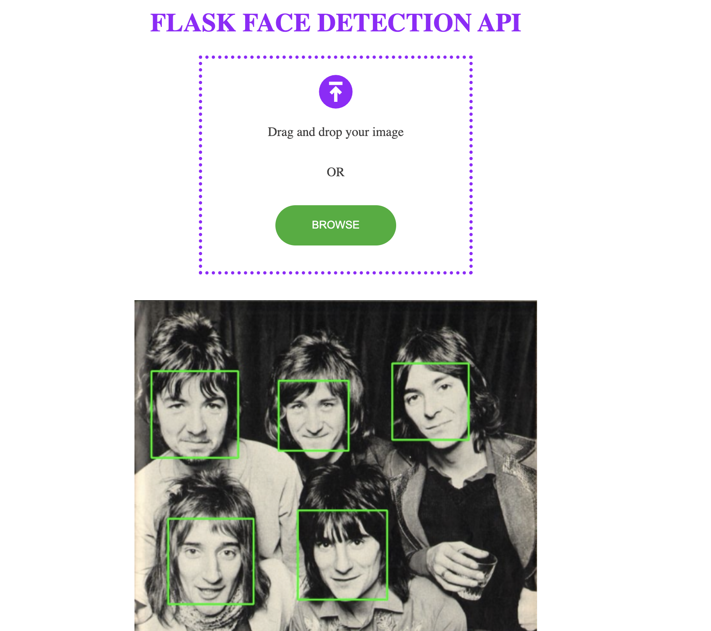

# FLASK-FACE-DETECTION-API

http://localhost:5000/apidocs/

http://localhost:5000/api/v1

# Installation

    git clone git@github.com:AlexanderDavies/flask-face-detection-api.git

    pip install -r requirements.txt

# Usage

    python app.py

You can access the Swagger UI by pointing your browser to [http://localhost:5000/apidocs](http://localhost:5000/apidocs)

To access the UI navigate to [http://localhost:5000/api/v1](http://localhost:5000/api/v1)

Drag and drop or click to upload a file and wait to receive the returned image with faces detected.

_note: this api uses the opencv-python package with the haarcascade_frontalface_default.xml cascade classifer, results can vary._

